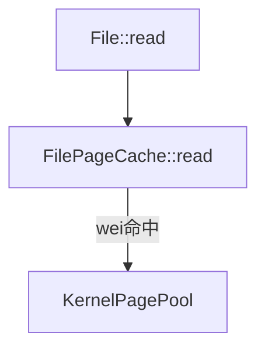

# 数据结构





# 系统调用

在 Linux 系统中，刷新文件脏页的系统调用主要包括以下几种，涵盖了针对单个文件、特定范围或全局的脏页同步操作：

---

### 1. **`fsync`**
- **功能**：将指定文件描述符对应的所有脏页（数据和元数据）强制写入磁盘，确保数据的持久化存储。
- **使用场景**：适用于需要确保文件完整性的关键操作，如数据库事务提交。
- **示例**：
  ```c
  #include <unistd.h>
  int fsync(int fd);
  ```

---

### 2. **`fdatasync`**
- **功能**：与 `fsync` 类似，但仅同步文件的数据部分，不强制刷新元数据（如文件修改时间），性能更高。
- **使用场景**：对性能敏感且不需要严格元数据一致性的场景。
- **示例**：
  ```c
  #include <unistd.h>
  int fdatasync(int fd);
  ```

---

### 3. **`sync`**
- **功能**：全局同步所有文件系统的脏页到磁盘，不针对单个文件。
- **特点**：无参数，强制所有缓冲区的数据写回磁盘，但可能阻塞较长时间。
- **示例**：
  ```c
  #include <unistd.h>
  void sync(void);
  ```

---

### 4. **`sync_file_range`**
- **功能**：指定文件描述符的特定范围（偏移和长度）进行脏页刷写，支持异步或同步操作，可通过标志位控制行为。
- **标志位示例**：
  - `SYNC_FILE_RANGE_WRITE`：启动异步写回。
  - `SYNC_FILE_RANGE_WAIT_BEFORE`/`SYNC_FILE_RANGE_WAIT_AFTER`：等待相关操作完成。
- **使用场景**：需要精细控制脏页刷新的高性能应用（如数据库日志分段写入）。
- **示例**：
  ```c
  #include <fcntl.h>
  int sync_file_range(int fd, off64_t offset, off64_t nbytes, unsigned int flags);
  ```

---

### 5. **`msync`**
- **功能**：将内存映射（`mmap`）区域的脏页同步到文件，可指定同步范围和模式（同步/异步）。
- **使用场景**：针对通过 `mmap` 修改的文件映射区域进行刷脏。
- **示例**：
  ```c
  #include <sys/mman.h>
  int msync(void *addr, size_t length, int flags); // flags 如 MS_SYNC（同步）、MS_ASYNC（异步）
  ```

---

### 其他相关机制
- **内核线程自动刷脏**：如 `pdflush` 或 `kswapd` 线程，根据内存压力或时间阈值自动刷脏，但无需用户主动调用。
- **文件操作隐式刷脏**：例如 `write` 写入时可能触发 `balance_dirty_pages` 平衡脏页比例，但非显式刷脏调用。

---

### 总结表格
| 系统调用         | 作用范围       | 特点                               | 适用场景                     |
|------------------|----------------|-----------------------------------|----------------------------|
| `fsync`          | 单个文件       | 同步数据和元数据                   | 关键数据持久化（如事务提交）|
| `fdatasync`      | 单个文件       | 仅同步数据，性能更高               | 高性能需求场景             |
| `sync`           | 全局           | 强制所有文件系统刷脏               | 系统级同步                 |
| `sync_file_range`| 文件指定范围   | 支持异步和范围控制                 | 精细控制的数据库写入       |
| `msync`          | 内存映射区域   | 同步 `mmap` 修改的页              | 内存映射文件操作           |

---

以上系统调用可根据具体需求选择使用。例如，数据库系统可能结合 `fsync` 和 `sync_file_range` 实现高效日志管理，而内存映射文件操作则依赖 `msync` 确保数据一致性。更多细节可参考 Linux 手册页（`man` 命令）或相关内核文档。


脏页写回

1. 文件关闭，写回整个文件的脏页
2. 写回全局的脏页


## 只读

所有文件共享全局的 page pool。

## 页面置换

全局的 page_pool 在 alloc page 的时候，自动页面置换。

页面置换后将 page 对象 Drop 掉。

文件的 page_cache 在取出 page 的时候，需要检查该页是否已经被 drop 掉。


## 脏页写回